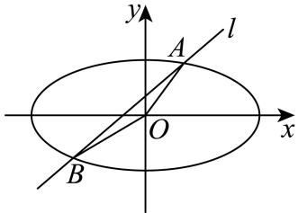

> [!faq]- 2024-2025学年内蒙古包头市高二（下）期末数学试卷解析
>
> > [!success]- **【答案】** 详见解析
>
> > [!note]- **【解析】**
> > 详见解析
> >
> > (1)根据已知 $2a=2\sqrt{3}$ ，即 $a=\sqrt{3}$ .
> >
> > 又根据 $e=\frac{\sqrt{6}}{3}$ ，可得 $c=\sqrt{\sqrt{2}}$ ，因此 $b^{2}=a^{2}-c^{2}=1$ ，
> >
> > 那么椭圆 $C$ 为 $\frac{x^2}{3} + y^2 = 1$ .
> >
> > (2)根据题直线 $l$ 与椭圆 $C$ 有两个交点 $A$ 和 $B$ ，设 $B(x_{2},y_{2})$ ， $A(x_{1},y_{1})$
> >
> > 联立直线l和椭圆方程 $\left\{\begin{aligned}y&=x+m\\ \frac{x^{2}}{3}&=y^{2}=1\end{aligned}\right.$ ，得 $\frac{x^{2}}{3}+(x+m)^{2}=14$ ，即 $4x^{2}+6mx+3m^{2}-3=0$ ，
> >
> > 所以根的判别式 $\Delta = (6m)^2 - 16(3m^2 - 3) > 0$ ，根据韦达定理可得 $x_{1}x_{2} = \frac{3m^{2} - 3}{4}$
> >
> > $$
> > x _ {1} + x _ {2} = \frac {- 3 m}{2}
> > $$
> >
> > 根据直线l不过原点可得-2<m<2且 $m\neq0$ .
> >
> > $$
> > | A B | = \sqrt {1 + 1 ^ {2}} \cdot \sqrt {(x _ {1} + x _ {2}) ^ {2} - 4 x _ {1} x _ {2}} = \sqrt {2} \cdot \sqrt {\left(- \frac {3 m}{2}\right) ^ {2} - 4 \cdot \frac {3 m ^ {2} - 3}{4}}
> > $$
> >
> > $$
> > = \sqrt {2} \cdot \sqrt {3 - \frac {3}{4} m ^ {2}} = \frac {\sqrt {6}}{2} \sqrt {4 - m ^ {2}}
> > $$
> >
> > 且点O到直线l的距离 $d=\frac{|m|}{\sqrt{2}}$ .
> >
> > 所以 $S = \frac{1}{2} |AB|d = \frac{1}{2}\cdot \frac{|m|}{\sqrt{2}}\cdot \frac{\sqrt{6}}{2}\sqrt{4 - m^2} = \frac{\sqrt{3}}{4} |m|\sqrt{4 - m^2} = \frac{\sqrt{3}}{4}\sqrt{m^2(4 - m^2)}$
> >
> > $$
> > \leqslant \frac {\sqrt {3}}{4} \frac {m ^ {2} + 4 - m ^ {2}}{2} = \frac {\sqrt {3}}{2}
> > $$
> >
> > 当且仅当 $m^{2}=4-m^{2}$ ，即 $m=\pm\sqrt{2}$ ，此时 $l:y=x\pm\sqrt{2}$ .
> >
> > 
