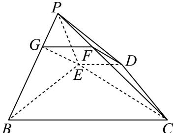
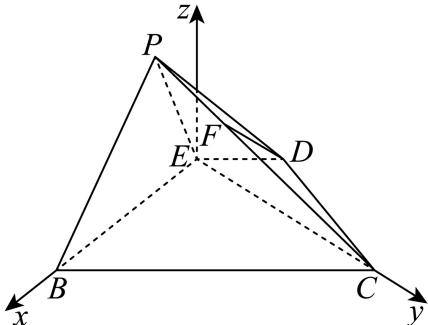

> [!faq]- 2024-2025学年内蒙古包头市高二（下）期末数学试卷解析
>
> > [!success]- **【答案】** 详见解析
>
> > [!note]- **【解析】**
> > 详见解析
> >
> > （1）证明：在线段 $PB$ 上取靠近点 $P$ 的四等分点 $G$ ，连接 $FG$ 与 $EG$
> >
> > 
> >
> > ∵ AD = 1 且 E 为 AD 的中点，
> >
> > $$
> > \therefore A E = D E = \frac {1}{2}
> > $$
> >
> > 由 $\angle AEB = 60^{\circ}$ 和 $\angle EBC = 90^{\circ}$ ，得 $BE = 1$ 及 $BC = 2$
> >
> > 则 $DE \parallel BC$ 和DE = $\frac{1}{4}BC$ ,
> >
> > 又∵ $\frac{PG}{PB}=\frac{PF}{PC}=\frac{1}{4}$ ，
> >
> > 所以 $GF \parallel BC$ 和GF = $\frac{1}{4}BC$ ,
> >
> > 从而 $DE \parallel GF$ 和DE = GF，
> >
> > 所以四边形DEGF为平行四边形，则 $DF \parallel EG$ .
> >
> > 又 $DF \notin$ 平面 $PBE, EG \subset$ 平面 $PBE$ ,
> >
> > 所以DF//平面PBE.
> >
> > (2)由 $\angle BEC=90^{\circ}$ 得 $BE\perp EC$ ，
> >
> > 因为平面 $PBE \perp$ 平面 $BCDE$ ，平面 $PBE \cap$ 平面 $BCDE = BE$ ， $EC \subset$ 平面 $BCDE$ ，所以 $EC \perp$ 平面 $PBE$ ，
> >
> > 以 $E$ 为坐标原点，建立如图所示空间直角坐标系 $E - xyz$ ：
> >
> > 
> >
> > 则 $E(0,0,0), P(\frac{1}{4}, 0, \frac{\sqrt{3}}{4}), C(0, \sqrt{3}, 0), B(1,0,0), D(-\frac{1}{4}, \frac{\sqrt{3}}{4}, 0)$
> >
> > 所以 $\overrightarrow{CP} = \left(\frac{1}{4}, -\sqrt{3}, \frac{\sqrt{3}}{4}\right), \overrightarrow{DC} = \left(\frac{1}{4}, \frac{3\sqrt{3}}{4}, 0\right)$
> >
> > 设平面PCD的法向量为 $\overrightarrow{n}=(x,y,z)$ ,
> >
> > 则 $\left\{ \begin{array}{l} \overrightarrow{n} \bullet \overrightarrow{CP} = (x, y, z) \bullet (\frac{1}{4}, -\sqrt{3}, \frac{\sqrt{3}}{4}) = \frac{1}{4} x - \sqrt{3} y + \frac{\sqrt{3}}{4} z = 0 \\ \overrightarrow{n} \bullet \overrightarrow{DC} = (x, y, z) \bullet (\frac{1}{4}, \frac{3\sqrt{3}}{4}, 0) = \frac{1}{4} x + \frac{3\sqrt{3}}{4} y = 0 \end{array} \right.$
> >
> > 令 $y=1$ ，则 $x=-3\sqrt{3}$ ，z=7，
> >
> > 所以 $\overrightarrow{n} = (-3\sqrt{3}, 1, 7)$
> >
> > 又 $EC \perp$ 平面PBE，
> >
> > 所以平面 $PBE$ 的一个法向量为 $\overrightarrow{EC} = (0, \sqrt{3}, 0)$ ，
> >
> > 则 $\cos\overrightarrow{n}$ ， $\overrightarrow{EC}=\frac{\overrightarrow{n}\bullet\overrightarrow{EC}}{|\overrightarrow{n}||\overrightarrow{EC}|}=\frac{\sqrt{3}}{\sqrt{77}\bullet\sqrt{3}}=\frac{\sqrt{77}}{77}$ ，
> >
> > 设平面PBE与平面PCD所成二面角为 $\theta$ ，
> >
> > $$
> > \sin \theta = \sqrt {1 - \left(\frac {\sqrt {7 7}}{7 7}\right) ^ {2}} = \frac {2 \sqrt {1 4 6 3}}{7 7}
> > $$
> >
> > 所以平面PBE与平面PCD所成二面角的正弦值为 $\frac{2\sqrt{1463}}{77}$ .
