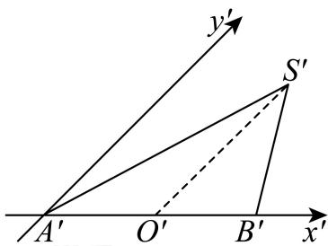

<!-- question-source:start -->
3. 已知 $\triangle SAB$ ，如图， $\triangle S'A'B'$ 是水平放置的 $\triangle SAB$ 的直观图，且 $O'S' // y'$ ， $2A'O' = O'S' = 2$ ， $\triangle SAB$ 中 $AB$ 边上的高为（）

<!-- question-source:end -->

![[Q00091348A1]]
