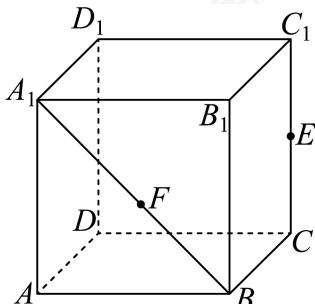

<!-- question-source:start -->
12. 如图, 在棱长为2的正方体中 $ABCD - A_{1}B_{1}C_{1}D_{1}$ , $E$ 为线段 $CC_{1}$ 的中点, $F$ 为线段 $A_{1}B$ 上的动点 (含端点), 则下列结论正确的有 ( )

A. 过 $A, D_{1}, E$ 三点的平面截正方体 $ABCD - A_{1}B_{1}C_{1}D_{1}$ 所得的截面的面积为 $\frac{9}{2}$ B. 存在点 $F$ , 使得平面 $EF //$ 平面 $AD_{1}C$

C. 当 $F$ 在线段 $A_{1}B$ 上运动时, 三棱锥 $C - AFD_{1}$ 的体积不变

D. $FA + FC$ 的最小值为 $2\sqrt{2 + \sqrt{2}}$
<!-- question-source:end -->

![[Q00091357A1]]
