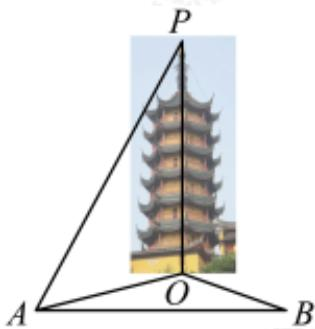

<!-- question-source:start -->
14. 中国古典神话故事《白蛇传》中“水漫金山寺”中的金山寺位于镇江金山公园内,南宋时期,寺里南北相向的两座宝塔,一名荐慈塔,一名荐寿塔,后双塔毁于火,明代重建该塔,当年值逢慈禧60大寿,地方官员以此塔作为贺礼进贺,故取名慈寿塔.某校高一研究性学习小组为了实地测量该塔的高度,选取与塔座中心O在同一水平平面内的两个测量基点A与B,在A点测得,塔丁P的仰角为 $45^{\circ}$ , O在A的北偏东 $60^{\circ}$ 处,B在A的正东方向100米处,且在B点测得O与A的张角为 $45^{\circ}$ ,则慈寿塔的高度约为\_\_\_\_米(参考数值: $\sqrt{3} \approx 1.732$ ,结果四舍五入,保留整数).

<!-- question-source:end -->

![[Q00091359A1]]
