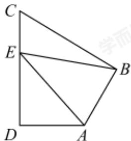

<!-- question-source:start -->
16. 如图，在平面四边形ABCD中， $AB \perp BC$ ， $AD \perp CD$ ， $\angle BAD = 120^{\circ}$ ，
AB = AD = 2. 若点E为边CD上的动点，则 $\overrightarrow{AE} \cdot \overrightarrow{BE}$ 的最小值为 \_\_\_\_.

<!-- question-source:end -->

![[Q00091361A1]]
