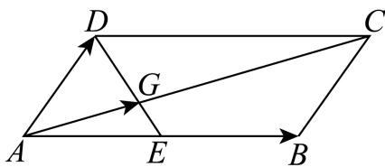

<!-- question-source:start -->
17. 如图，在平行四边形ABCD中，AD=2，AB=4， $\angle DAB=\frac{\pi}{3}$ ，点E是AB的中点，连接DE，AC，记它们的交点为G，设 $\overrightarrow{AB}=\overrightarrow{a}$ ， $\overrightarrow{AD}=\overrightarrow{b}$ .

(1)用 $\overrightarrow{a}$ ， $\overrightarrow{b}$ 表示 $\overrightarrow{AC}$ ， $\overrightarrow{AG}$ ;

(2)求 $\left\langle \overrightarrow{AC},\overrightarrow{AB}\right\rangle$ 的余弦值.
<!-- question-source:end -->

![[Q00091362A1]]
