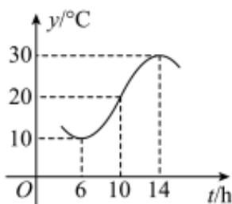

<!-- question-source:start -->
18. 如图，某地一天中6\~14时的温度变化曲线近似满足 $y = A \sin (\omega t + \varphi) + b$ （ $A > 0, \omega > 0, 0 < \varphi < \pi$ ）.

（1）求出这段曲线的函数解析式；

（2）某行业在该地经营，当温度在区间 $[20 - 5\sqrt{2}, 20 + 5\sqrt{2}]$ 之间时为最佳营业时间，那么该行业在6\~14时，最佳营业时间有多少小时？
<!-- question-source:end -->

![[Q00092684A1]]
