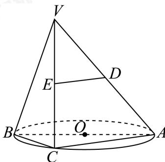

<!-- question-source:start -->
19. 如图，AB是⊙O的直径，点C是⊙O上的动点，D，E分别是VA，VC的中点.

(1)若C为弧AB的中点，求ED与AB所成的角；

(2)若过动点C的直线VC垂直于 $\odot O$ 所在平面，判断直线DE与平面VBC的位置关系，并说明理由.
<!-- question-source:end -->

![[Q00092685A1]]
