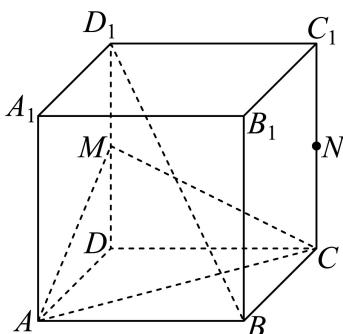

<!-- question-source:start -->
21. 如图，在正方体 $ABCD - A_{1}B_{1}C_{1}D_{1}$ 中， $M$ 为 $DD_{1}$ 的中点.

(1) 求证: $BD_{1} / /$ 平面AMC

(2) 若 $N$ 为 $CC_{1}$ 的中点, 求证: 平面 $AMC // \text{平面} BND_{1}$ .
<!-- question-source:end -->

![[Q00092686A1]]
