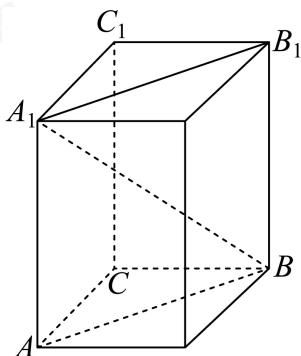

> [!faq]- 2024-2025学年内蒙古包头昆都仑区包头市第六中学高一下学期期中数学试卷解析
>
> > [!success]- **【答案】** A
>
> > [!note]- **【分析】**
> > 将直棱柱补全成长体即可知道其外接球直径，进而可求其体积.
>
> > [!note]- **【解析】**
> > 如图所示，将直三棱柱 $ABC-A_{1}B_{1}C_{1}$ 补全成长方体，
> >
> > 
> >
> > 则长方体的体对角线 $\left|A_{1}B\right|=\sqrt{\left|AB\right|^{2}+\left|AA_{1}\right|^{2}}=\sqrt{4+4}=2\sqrt{2}$ 为该三棱柱外接球的直径，
> >
> > 所以其半径为 $R=\frac{|A_{1}B|}{2}=\sqrt{2},$
> >
> > $\therefore$ 球 $O$ 的体积为 $V = \frac{4}{3}\pi R^3 = \frac{4}{3}\pi \times 2\sqrt{2} = \frac{8\sqrt{3}}{3}\pi ,$
> >
> > 故选：A.
