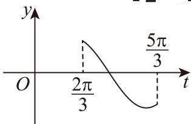
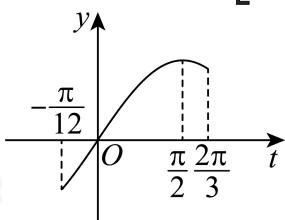

> [!faq]- 2024-2025学年内蒙古包头昆都仑区包头市第六中学高一下学期期中数学试卷解析
>
> > [!success]- **【答案】** D
>
> > [!note]- **【分析】**
> > 根据题给条件得到 $g(x)$ 解析式，再根据正弦函数的性质逐项判断即可.
>
> > [!note]- **【解析】**
> > 函数 $f(x)=\sin\left(x+\frac{\pi}{3}\right)$ 的图象上所有点的横坐标缩短到原来的 $\frac{1}{2}$ 倍（纵坐标不变）得到新函数 $y=\sin\left(2x+\frac{\pi}{3}\right)$ ,
> >
> > 再把所得图象上所有点向右平移 $\frac{\pi}{3}$ 个单位长度得到新函数
> >
> > $y = \sin \left[2\left(x - \frac{\pi}{3}\right) + \frac{\pi}{3}\right] = \sin \left(2x - \frac{\pi}{3}\right)$ ，则 $g(x) = \sin \left(2x - \frac{\pi}{3}\right)$ .
> >
> > 对于A选项， $T = \frac{2\pi}{2} = \pi$ ， $g(x)$ 的最小正周期是 $\pi$ ，A正确；
> >
> > 对于B选项， $x=\frac{\pi}{6}$ 时， $g\left(\frac{\pi}{6}\right)=\sin\left(2\times\frac{\pi}{6}-\frac{\pi}{3}\right)=\sin0=0\neq\pm1,$
> >
> > 所以 $x = \frac{\pi}{6}$ 不是 $g(x)$ 的一条对称轴，B错误；
> >
> > 对于C选项， $x \in \left[\frac{\pi}{2}, \pi\right]$ ，则 $t = 2x - \frac{\pi}{3} \in \left[\frac{2\pi}{3}, \frac{5\pi}{3}\right]$ ,
> >
> > 所以 $y = \sin t$ 在 $\left(\frac{2\pi}{3}, \frac{3\pi}{2}\right)$ 上单调递减，在 $\left(\frac{3\pi}{2}, \frac{5\pi}{3}\right)$ 上单调递增，则 $g(x)$ 在区间 $\left[\frac{\pi}{2},\pi\right]$ 上不单调，C错误；
> >
> > 
> >
> > 对于D选项，当 $x\in\left[\frac{\pi}{8},\frac{\pi}{2}\right]$ 时， $t=2x-\frac{\pi}{3}\in\left[-\frac{\pi}{12},\frac{2\pi}{3}\right]$
> >
> > 当 $t = -\frac{\pi}{12}$ 时
> >
> > $$
> > y = \sin \left(- \frac {\pi}{1 2}\right) = \sin \left(\frac {\pi}{4} - \frac {\pi}{3}\right) = \sin \frac {\pi}{4} \cos \frac {\pi}{3} - \cos \frac {\pi}{4} \sin \frac {\pi}{3} = \frac {\sqrt {2} - \sqrt {6}}{4}
> > $$
> >
> > 当 $t=\frac{\pi}{2}$ 时y=1,
> >
> > 则 $y = \sin t \in \left[\frac{\sqrt{2} - \sqrt{6}}{4}, 1\right]$ ，得 $g(x)$ 的取值范围为 $\left[\frac{\sqrt{2} - \sqrt{6}}{4}, 1\right]$ ，D正确.
> >
> > 
> >
> > 故选：D.
