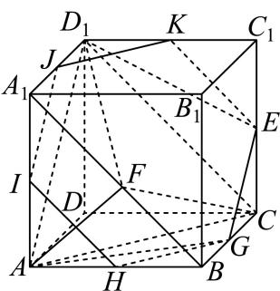
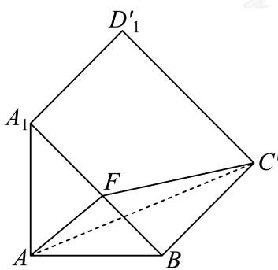

> [!faq]- 2024-2025学年内蒙古包头昆都仑区包头市第六中学高一下学期期中数学试卷解析
>
> > [!success]- **【答案】** ACD
>
> > [!note]- **【分析】**
> > 根据正方体的性质，结合线面平行、面面平行的判定定理和性质定理逐项判定可①②③确定ABC的正误，利用展开法和点距离的三角不等式，结合余弦定理计算可求得 $FA + FC$ 的最小值，进而判定D.
>
> > [!note]- **【解析】**
> > 对于A，∵正方体的对面互相平行，
> >
> > ∴过 $A, D_1, E$ 三点的平面截正方体 $ABCD - A_1B_1C_1D_1$ 的对面 $ADD_1A_1, BCC_1B_1$ 所得截线互相平行，
> >
> > 又∵ $E$ 为线段 $CC_1$ 的中点，∴截面交BC于其中点G，
> >
> > 连接 $AG, GE, ED_1, D_1A$ ，则四边形 $AD_1EG$ 即为所求截面，显然为等腰梯形，
> >
> > 且 $AD_1 = 2\sqrt{2}, EG = \sqrt{2}, AG = D_1E = \sqrt{2^2 + 1^2} = \sqrt{5}$ ,
> >
> > 梯形的高 $h = \sqrt{AG^2 - \left(\frac{AD_1 - EG}{2}\right)^2} = \sqrt{5 - \left(\frac{\sqrt{2}}{2}\right)^2} = \frac{3\sqrt{2}}{2}$ ,
> >
> > 面积为 $S = \frac{(AD_1 + EG)h}{2} = \frac{(2\sqrt{2} + \sqrt{2}) \cdot \frac{3\sqrt{2}}{2}}{2} = \frac{9}{2}$ ，故A正确；
> >
> > 过 $E$ 与平面 $AD_1C$ 平行的直线都在过 $E$ 与平面 $AD_1C$ 平行的平面内，
> >
> > 易知过 $E$ 与平面 $AD_1C$ 平行的平面截正方体 $ABCD - A_1B_1C_1D_1$ 的截面为如图所示1的六边形 $EGHIJK$ ，其各顶点都是正方体的相应棱的中点，
> >
> > 由于 $A_1B//IH, A_1H$ 不在平面 $EGHIJK$ 内，∴平面 $EGHIJK$ 与直线 $A_1B$ 平行，
> >
> > ∴平面 $EGHIJK$ 与线段 $A_1B$ 没有公共点，故B错误；
> >
> > ∵ $A_1B//D_1C, D_1C \subset$ 平面 $AD_1C, A_1B$ 不在平面 $AD_1C$ 内，
> >
> > ∴ $A_1B//$ 平面 $AD_1C$ ,
> >
> > 又∵ $F \in A_1B$ , ∴ $F$ 到平面 $AD_1C$ 的距离为定值，又∵△ $AD_1C$ 的面积为定值，
> >
> > ∴当 $F$ 在线段 $A_1B$ 上运动时，三棱锥 $C - AFD_1$ 的体积不变，故C正确；
> >
> > 将矩形 $A_1D_1CB$ 展开到与等腰直角三角形 $A_1AB$ 在同一平面内，如图2所示，
> >
> > $$
> > F A + F C \geq A C = \sqrt {2 ^ {2} + 2 ^ {2} - 2 \times 2 \times 2 \times \left(- \frac {\sqrt {2}}{2}\right)} = 2 \sqrt {2 + \sqrt {2}},
> > $$
> >
> > 当A,F,C共线时取等号，故D正确.
> >
> > 故选：ACD.
> >
> >   
> > 图1
> >
> >   
> > 图2
