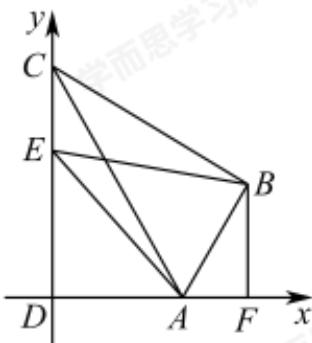

> [!faq]- 2024-2025学年内蒙古包头昆都仑区包头市第六中学高一下学期期中数学试卷解析
>
> > [!success]- **【答案】** $\frac{21}{4}$
>
> > [!note]- **【分析】**
> > 以D为原点， $\overrightarrow{DA},\overrightarrow{DC}$ 的方向分别为x轴，y轴的正方向建立平面直角坐标系，利用向量坐标运算，结合二次函数性质可得.
>
> > [!note]- **【解析】**
> > 连接AC，因为 $AB\perp BC$ ， $AD\perp CD$ ，AB=AD,AC=AC,
> >
> > 所以 $\mathbf{Rt} \triangle ACD \cong \mathbf{Rt} \triangle ACB,$
> >
> > 又 $\angle BAD=120^{\circ}$ ，所以 $\angle DAC=60^{\circ}$ ，
> >
> > 所以 $DC = AD\tan 60^{\circ} = 2\sqrt{3}.$
> >
> > 过点B作AD的垂线BF，垂足为F，
> >
> > 易知，在Rt $\triangle ABF$ 中， $\angle BAF = 60^{\circ}$ , $AB = 2$
> >
> > 所以 $BF=\sqrt{3},AF=1,$
> >
> > 以D为原点， $\overrightarrow{DA},\overrightarrow{DC}$ 的方向分别为x轴，y轴的正方向建立平面直角坐标系，则 $A(2,0),B(3,\sqrt{3})$ ，
> > 设 $E(0,m),m\in[0,2\sqrt{3}]$ ,
> >
> > 则 $\overrightarrow{AE} = (-2,m),\overrightarrow{BE} = (-3,m - \sqrt{3})$
> >
> > $$
> > \overrightarrow {A E} \cdot \overrightarrow {B E} = 6 + m (m - \sqrt {3}) = m ^ {2} - \sqrt {3} m + 6,
> > $$
> >
> > 当 $m=\frac{\sqrt{3}}{2}$ 时， $\overrightarrow{AE}\cdot\overrightarrow{BE}$ 有最小值 $\frac{21}{4}$ .
> >
> > 故答案为： $\frac{21}{4}$
> >
> > 
