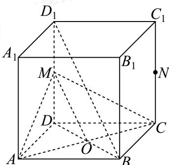
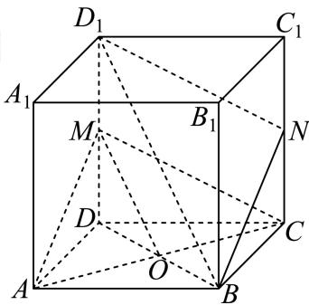

> [!faq]- 2024-2025学年内蒙古包头昆都仑区包头市第六中学高一下学期期中数学试卷解析
>
> > [!success]- **【答案】** 详见解析 (2) 证明见解析
>
> > [!note]- **【解析】**
> > （1）如图：连接BD，设 $AC \cap BD = O$ ，连接OM，
> >
> > 
> >
> > ∵在正方体 $ABCD-A_{1}B_{1}C_{1}D_{1}$ 中，四边形ABCD是正方形，∴O是BD中点，
> >
> > ∵ M 是 $DD_{1}$ 的中点，∴ $OM \parallel BD_{1}$ ，
> >
> > $\because BD_{1} \not\subset$ 平面 $AMC, OM \subset$ 平面 $AMC,$
> >
> > $\therefore BD_{1} // 平面AMC.$
> >
> > (2) 如图: 连接 $D_{1} N$ , $NB$ ,
> >
> > 
> >
> > $\because N$ 为 $CC_{1}$ 的中点， $M$ 为 $DD_{1}$ 的中点，
> >
> > ∴ $CN = D_{1}M$ ，又∵ $CN // D_{1}M$ ，
> > ∴四边形 $CND_{1}M$ 为平行四边形，∴ $D_{1}N//CM$ 又∵MC⊂平面AMC, ∵ $D_{1}N\subset$ 平面AMC, ∴ $D_{1}N//$ 平面
> > AMC
> > 由（1）知 $BD_{1}//$ 平面AMC, ∵ $BD_{1}\cap D_{1}N=D_{1}, BD_{1}\subset$ 平面 $BND_{1}, D_{1}N\subset$ 平面 $BND_{1}$ ,
> > ∴平面AMC//平面 $BND_{1}$ .
