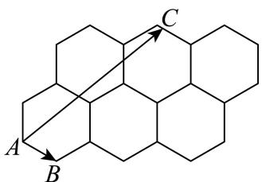

<!-- question-source:start -->
8. 正六边形在中国传统文化中象征着“六合”与“六顺”，这种形状常被用于各种传统装饰和建筑中，如首饰盒、古建筑的窗户、古井口等。已知6个边长均为2的正六边形的摆放位置如图所示，C是这6个正六边形内部(包括边界)的动点，则 $\overrightarrow{AC} \cdot \overrightarrow{AB}$ 的最大值为（）

A. 12
B. 16
C. 18
D. 20
<!-- question-source:end -->

![[Q00091312A1]]
