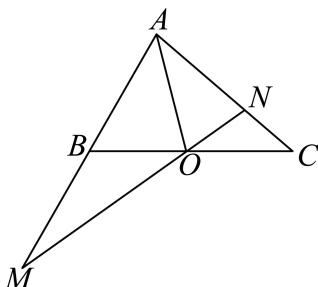

<!-- question-source:start -->
10. 如图，在△ABC中，点O是BC的上一点（不包括端点），过点O的直线分别交直线AB，AC于不同的两点M,N，且 $\overrightarrow{AB}=m\overrightarrow{AM},\overrightarrow{AC}=n\overrightarrow{AN}$ ，则下列结论正确的是（）

A. $\overrightarrow{BC} = m\overrightarrow{AM} - n\overrightarrow{AN}$

B. 若 $O$ 是 $BC$ 的中点，则 $\overrightarrow{AO} = \frac{1}{2}\overrightarrow{AB} +\frac{1}{2}\overrightarrow{AC}$

C. 若 $O$ 是 $BC$ 的中点，则 $m + n = 2$

D. 若 $m = \frac{1}{3}, n = 3$ ，则 $\frac{\left|\overrightarrow{BO}\right|}{\left|\overrightarrow{BC}\right|} = \frac{1}{4}$
<!-- question-source:end -->

![[Q00091314A1]]
