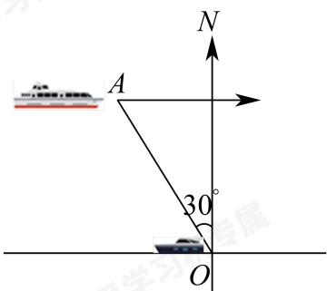

<!-- question-source:start -->
14. 如图，某港口O要将一件重要物品用小艇送到一艘正在航行的轮船上。在小艇出发时，轮船位于港口O北偏西30°方向且与该港口相距20nmile的A处，并以15nmile/h的航行速度沿正东方向匀速行驶。假设该小艇沿直线方向以 $5\sqrt{7}$ nmile/h的航行速度匀速行驶，经过th与轮船相遇，则t的最小值为\_\_\_\_。

<!-- question-source:end -->

![[Q00091318A1]]
