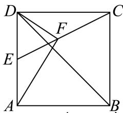

<!-- question-source:start -->
18. 如图，已知正方形ABCD的边长为2，E为AD的中点.

(1)求 $\overrightarrow{EC} \cdot \overrightarrow{AB}$ ;

(2)求 $\overrightarrow{EC}$ 与 $\overrightarrow{BD}$ 夹角的余弦值；

(3)若F为线段EC上一点，且AF⊥DF，求 $\frac{\left|\overrightarrow{EF}\right|}{\left|\overrightarrow{EC}\right|}$ ;

(4)若 $\overrightarrow{EF} = \overrightarrow{FC}$ ，求△ $ADF$ 外接圆的半径.
<!-- question-source:end -->

![[Q00092656A1]]
