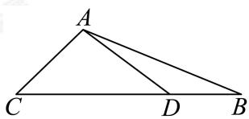

> [!faq]- 2024-2025学年内蒙古包头青山区包头市北重三中高一下学期期中数学试卷解析
>
> > [!success]- **【答案】** D
>
> > [!note]- **【分析】**
> > 根据题意利用等面积法结合面积公式运算求解即可.
>
> > [!note]- **【解析】**
> > 由题意可知： $\angle BAC = \frac{2\pi}{3},\angle CAD = \frac{\pi}{2},\angle BAD = \frac{\pi}{6},$
> >
> > 
> >
> > 因为 $S_{\triangle ABC} = S_{\triangle ABD} + S_{\triangle ACD}$
> >
> > 即 $\frac{1}{2} \times 4 \times 8 \times \frac{\sqrt{3}}{2} = \frac{1}{2} \times AD \times 4 + \frac{1}{2} \times AD \times 8 \times \frac{1}{2}$ ，解得 $AD = 2\sqrt{3}$ .
> >
> > 故选：D.
