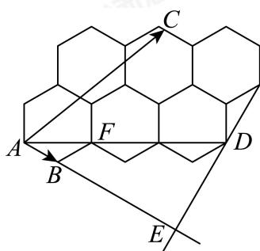

> [!faq]- 2024-2025学年内蒙古包头青山区包头市北重三中高一下学期期中数学试卷解析
>
> > [!success]- **【答案】** C
>
> > [!note]- **【分析】**
> > 过C作 $CE\perp AB$ 交AB延长线于E点，则
>
> > [!note]- **【解析】**
> > 
> >
> > 过C作 $CE\perp AB$ 交AB延长线于E点，则 $\overrightarrow{AC}\cdot\overrightarrow{AB}=\overrightarrow{AE}\cdot\overrightarrow{AB}=\left|\overrightarrow{AE}\right|\cdot\left|\overrightarrow{AB}\right|$
> >
> > 因为6个正六边形边长均为2，如图，当C位于D点时， $\overrightarrow{AC}\cdot\overrightarrow{AB}$ 取得最大值，
> > 此时 $\angle DAE=\frac{\pi}{6},AD=3AF=6\sqrt{3},AE=9,$ $\overrightarrow{AD}\cdot\overrightarrow{AB}=\overrightarrow{AE}\cdot\overrightarrow{AB}=9\times2=18,$
> >
> > 故选：C.
