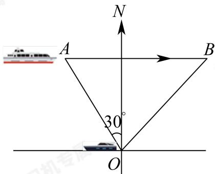

> [!faq]- 2024-2025学年内蒙古包头青山区包头市北重三中高一下学期期中数学试卷解析
>
> > [!success]- **【答案】** 2
>
> > [!note]- **【分析】**
> > 画出图形，利用余弦定理建立方程求解即可.
>
> > [!note]- **【解析】**
> > 如图，假设小艇与轮船在点B相遇，
> >
> > 
> >
> > 由题意得 $\angle OAB = \frac{\pi}{2} -\frac{\pi}{6} = \frac{\pi}{3},OA = 20\mathrm{nmile},AB = 15t\mathrm{nmile},$ $OB = 5\sqrt{7} t\mathrm{nmile}.$
> >
> > 由余弦定理得 $OB^2 = OA^2 + AB^2 - 2OA \cdot AB\cos \angle OAB$ ，得 $t^2 - 6t + 8 = 0$
> >
> > 解得 $t = 2$ 或4. 故 $\pmb{t}$ 的最小值为2.
> >
> > 故答案为：2
