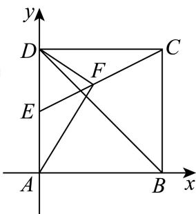

> [!faq]- 2024-2025学年内蒙古包头青山区包头市北重三中高一下学期期中数学试卷解析
>
> > [!success]- **【答案】** 详见解析 (2) $-\frac{\sqrt{10}}{10}$ (3) $\frac{\sqrt{5}}{5}$ (4) $\frac{\sqrt{65}}{8}$
>
> > [!note]- **【分析】**
> > （1）建立直角坐标系，利用坐标运算求数量积；
>
> > [!note]- **【解析】**
> > （1）如图，以 $A$ 为原点， $AB, AD$ 所在的直线分别为 $\pmb{x}$ 轴， $\pmb{y}$ 轴建立直角坐标系，
> >
> > 则 $A(0,0)$ , $B(2,0)$ , $C(2,2)$ , $D(0,2)$ , $E(0,1)$ .
> >
> > 
> >
> > 因为 $\overrightarrow{EC} = (2,1),\overrightarrow{AB} = (2,0)$ ，所以 $\overrightarrow{EC}\cdot \overrightarrow{AB} = 2\times 2 + 0 = 4.$
> >
> > (2) 因为 $\overrightarrow{BD}=(-2,2)$ ， $\overrightarrow{EC}=(2,1)$ ,
> >
> > 所以 $\overrightarrow{EC}$ 与 $\overrightarrow{BD}$ 夹角的余弦值为 $\frac{\overrightarrow{EC} \cdot \overrightarrow{BD}}{\left|\overrightarrow{EC}\right|\left|\overrightarrow{BD}\right|} = \frac{-4 + 2}{\sqrt{5} \times 2\sqrt{2}} = -\frac{\sqrt{10}}{10}$ .
> >
> > (3) 设 $\overrightarrow{EF} = \lambda \overrightarrow{EC} (0 \leq \lambda \leq 1)$ ，则 $\overrightarrow{EF} = \lambda \overrightarrow{EC} = (2\lambda, \lambda)$ ，得 $F(2\lambda, \lambda + 1)$ .
> >
> > 因为 $\overrightarrow{AF} = (2\lambda, \lambda + 1), \overrightarrow{DF} = (2\lambda, \lambda - 1), AF \perp DF$ ，所以 $\overrightarrow{AF} \cdot \overrightarrow{DF} = 4\lambda^2 + \lambda^2 - 1 = 0,$
> >
> > 得 $\lambda = \frac{\sqrt{5}}{5}$ （负根舍去），故 $\frac{\left|\overrightarrow{EF}\right|}{\left|\overrightarrow{EC}\right|} = \frac{\sqrt{5}}{5}$ .
> > (4）由 $\overrightarrow{EF} = \overrightarrow{FC}$ ，得 $F\left(1, \frac{3}{2}\right)$ ，则 $\overrightarrow{AF} = \left(1, \frac{3}{2}\right), \overrightarrow{DF} = \left(1, -\frac{1}{2}\right)$ ，得 $\cos \angle AFD = \frac{\overrightarrow{AF} \cdot \overrightarrow{DF}}{\left|\overrightarrow{AF}\right|\left|\overrightarrow{DF}\right|} = \frac{1 - \frac{3}{4}}{\frac{\sqrt{13}}{2} \times \frac{\sqrt{5}}{2}} = \frac{1}{\sqrt{65}}.$ 设△ $ADF$ 外接圆的半径为 $R$ ，则 $2R = \frac{AD}{\sin\angle AFD}$ ，得 $R = \frac{2}{2 \times \frac{8}{\sqrt{65}}} = \frac{\sqrt{65}}{8}$ .
