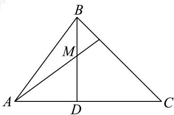

> [!faq]- 2024-2025学年内蒙古包头青山区包头市北重三中高一下学期期中数学试卷解析
>
> > [!success]- **【答案】** 详见解析 (2)10 (3) $AB = \frac{25\sqrt{34}}{34}$
>
> > [!note]- **【分析】**
> > （1）根据已知及正弦边角关系得 $b^{2}+c^{2}-a^{2}=\frac{6}{5}bc$ ，再由余弦定理求 $\cos A;$
>
> > [!note]- **【解析】**
> > （1）由正弦定理得 $5b^{2} + 5c^{2} = 6bc + 5a^{2}$ ，即 $b^{2} + c^{2} - a^{2} = \frac{6}{5} bc$
> >
> > 由余弦定理得 $\cos A = \frac{b^2 + c^2 - a^2}{2bc} = \frac{3}{5}$ .
> >
> > (2) 由 $\cos A = \frac{3}{5}$ , 得 $\sin A = \frac{4}{5}$ .
> >
> > 由（1）可得 $b^{2}+c^{2}=20+\frac{6}{5}bc\geq2bc$ ，得 $bc\leq25$
> >
> > 当且仅当b=c=5时，等号成立，
> >
> > 所以 $S_{\triangle ABC} = \frac{1}{2} bc\sin A = \frac{2}{5} bc \leq 10$ . 故 $\triangle ABC$ 面积的最大值为10.
> >
> > (3) 如图，设 $\angle DAM = \alpha (0 < \alpha < A)$ .
> >
> > 
> >
> > 在 $\triangle AMD$ 中， $MD = AM\sin \alpha = 3\sin \alpha$
> >
> > 在 $\triangle ABD$ 中，由 $\angle BAD + \angle ABM = \frac{\pi}{2}$
> >
> > $$
> > \sin \angle A B M = \sin \left(\frac {\pi}{2} - \angle B A D\right) = \cos \angle B A D = \frac {3}{5}.
> > $$
> >
> > 在 $\triangle ABM$ 中， $\sin \angle AMB = \sin \left(\frac{\pi}{2} + \alpha\right) = \cos \alpha,$
> >
> > 由正弦定理得 $\frac{AM}{\sin\angle ABM} = \frac{AB}{\sin\angle AMB}$ ，得
> >
> > $$
> > A B = \frac {\sin \angle A M B}{\sin \angle A B M} \cdot A M = \frac {5}{3} \cos \alpha \times 3 = 5 \cos \alpha ,
> > $$
> >
> > 所以
> >
> > $$
> > A B + M D = 5 \cos \alpha + 3 \sin \alpha = \sqrt {3 4} \left(\frac {3}{\sqrt {3 4}} \sin \alpha + \frac {5}{\sqrt {3 4}} \cos \alpha\right) = \sqrt {3 4} \sin (\alpha + \varphi)
> > $$
> >
> > 其中 $\sin \varphi = \frac{5\sqrt{34}}{34},\cos \varphi = \frac{3\sqrt{34}}{34}.$
> >
> > 当 $\alpha +\varphi = \frac{\pi}{2}$ 时， $AB + MD$ 取得最大值，此时 $\cos \alpha = \sin \varphi = \frac{5\sqrt{34}}{34}$
> >
> > 得 $AB = 5\cos \alpha = \frac{25\sqrt{34}}{34}$
