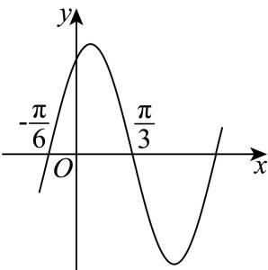

<!-- question-source:start -->
6. 已知 $f(x) = 2\sin (\omega x + \varphi) (\omega > 0, 0 < \varphi < \pi)$ 的部分图象如图所示，则 $f\left(-\frac{\pi}{24}\right)$ 的值为（）

A. 1  
B. $\sqrt{2}$ C. $\sqrt{3}$ D. 2
<!-- question-source:end -->

![[Q00091527A1]]
