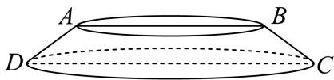
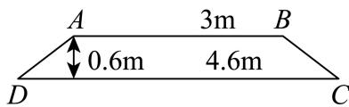

<!-- question-source:start -->
8. 亭是我国古典园林中最具特色的建筑形式，它是逗留赏景的场所，也是园林风景的重要点缀。重檐圆亭（图1）是常见的一类亭，其顶层部分可以看作是一个圆锥以及一个圆台（图2）的组合体。已知某重檐凉亭的圆台部分的轴截面如图3所示，则该圆台部分的侧面积为（）

  
图1

  
图2

  
图3

A. $3.6 \pi \mathrm{~m}^{2}$ B. $3.8 \pi \mathrm{~m}^{2}$ C. $4.2 \pi \mathrm{~m}^{2}$ D. $5.4 \pi \mathrm{~m}^{2}$
<!-- question-source:end -->

![[Q00091529A1]]
