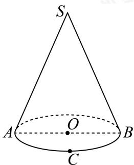

<!-- question-source:start -->
11. 如图, 圆锥 $SO$ 的底面半径为 1 , 侧面积为 $3 \pi$ , $\triangle SAB$ 是圆锥的一个轴截面, $C$ 是底面圆周上异于 $A$ , $B$ 的一点, 则下列说法正确的是 ( )

A. $\triangle SAB$ 的面积为 $2\sqrt{2}$

B. 圆锥SO的侧面展开图的圆心角为 $\frac{2\pi}{3}$

C. 由 $C$ 点出发绕圆锥侧面旋转一周，又回到 $C$ 点的细绳长度最小值为 $3 \sqrt{3}$

D. 若 $AC = \sqrt{2}$ ，则三棱锥 $O - SAC$ 的体积为 $\frac{\sqrt{2}}{2}$
<!-- question-source:end -->

![[Q00091532A1]]
