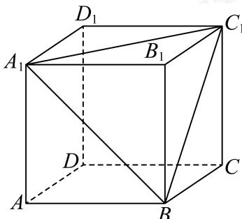

<!-- question-source:start -->
18. 如图，长方体 $ABCD - A_{1}B_{1}C_{1}D_{1}$ 的三条棱的长分别为 $AB = 3, AD = 3, AA_{1} = \sqrt{7}$ .

(1)将此长方体沿相邻三个面的对角线截去一个棱锥 $B_{1}-A_{1}BC_{1}$ ，求剩下的几何体的体积；

(2)求长方体ABCD-A1B1C1D1外接球的体积和表面积.
<!-- question-source:end -->

![[Q00091539A1]]
