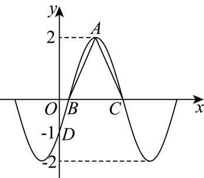

<!-- question-source:start -->
19. 已知函数 $f(x) = A\sin (\omega x + \varphi) \left( A > 0, \omega > 0, -\frac{\pi}{2} < \varphi < \frac{\pi}{2} \right)$ 的部分图象如图所示，且 $D(0, -1)$ ， $\triangle ABC$ 的面积等于 $\frac{\pi}{2}$ .

(1)求函数 $f(x)$ 的解析式；

(2)求函数 $f(x)$ 的对称轴和对称中心；

(3)将 $f(x)$ 图象上所有的点向左平移 $\frac{\pi}{4}$ 个单位长度，得到函数 $y=g(x)$ 的图象，若对于任意的 $x_{1},x_{2}\in[\pi-m,m]$ ，当 $x_{1}>x_{2}$ 时， $f(x_{1})-f(x_{2})<g(x_{1})-g(x_{2})$ 恒成立，求实数m的最大值.
<!-- question-source:end -->

![[Q00091540A1]]
