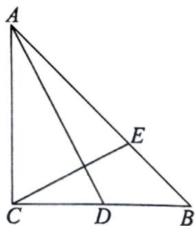

<!-- question-source:start -->
16. 如图， $\triangle ABC$ 中， $\angle C = 90^{\circ}$ ， $CA = CB$ ， $D$ 为 $CB$ 中点， $E$ 为 $AB$ 上一点，且 $\overrightarrow{AE} = \lambda \overrightarrow{AB}$ ，设 $\overrightarrow{CA} = \overrightarrow{a}$ ， $\overrightarrow{CB} = \overrightarrow{b}$ .

(1) 请用 $\overrightarrow{a}$ ， $\overrightarrow{b}$ 来表示 $\overrightarrow{AD}$ ， $\overrightarrow{CE}$ ;

（2）若 $AD \perp CE$ ，求 $\lambda$ 的值；

(3) 当 $\lambda = \frac{1}{3}$ 时，求 $\overrightarrow{AB}$ 与 $\overrightarrow{CE}$ 夹角的余弦值.
<!-- question-source:end -->

![[Q00092713A1]]
