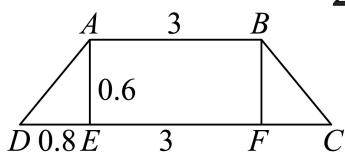

> [!faq]- 2024-2025学年内蒙古包头高一下学期期中数学试卷（景泰高级解析
>
> > [!success]- **【答案】** B
>
> > [!note]- **【分析】**
> > 先求出 $AD = BC = 1$ ，利用圆台侧面积公式进行求解.
>
> > [!note]- **【解析】**
> > 圆台的上底圆直径为3，上底圆直径为4.6，高为0.6，
> >
> > 过点 $A, B$ 作 $AE \perp CD, BF \perp CD$ , 垂足分别为 $E, F$ ,
> >
> > 故 $DE = CF = \frac{4.6 - 3}{2} = 0.8$ ，故 $AD = BC = \sqrt{0.8^2 + 0.6^2} = 1,$ 故该圆台部分的侧面积为 $\frac{(3\pi + 4.6\pi) \times 1}{2} = 3.8\pi \mathrm{m}^2$ . 故选：B
> >
> > 
