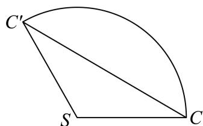

> [!faq]- 2024-2025学年内蒙古包头高一下学期期中数学试卷（景泰高级解析
>
> > [!success]- **【答案】** ABC
>
> > [!note]- **【分析】**
> > 根据给定条件，利用圆锥侧面积公式求出圆锥的母线长，再结合侧面展开图、锥体体积公式逐项判断.
>
> > [!note]- **【解析】**
> > 由圆锥SO的底面半径为1，侧面积为 $3\pi$ ，得圆锥母线l=3，圆锥的高 $h=\sqrt{l^{2}-1^{2}}=2\sqrt{2}$ ,
> >
> > 对于A， $S_{\triangle SAB} = \frac{1}{2} AB\cdot h = 2\sqrt{2}$ ，A正确；
> >
> > 对于B，圆锥SO的侧面展开图扇形弧长为 $2\pi$ ，圆心角为 $\frac{2\pi}{3}$ ，B正确；
> >
> > 对于C，将圆锥SO的侧面沿母线SC剪开展成平面图形，连接 $CC'$ ，如图，
> >
> > 所求细绳长度最小值为 $CC' = 2l \sin \frac{\pi}{3} = 3\sqrt{3}$ ，C正确；
> >
> > 
> >
> > 对于D，当 $AC=\sqrt{2}$ 时， $OC\perp OA,\ S_{\triangle AOC}=\frac{1}{2}OA\cdot OC=\frac{1}{2}$
> >
> > $V_{O - SAC} = V_{S - OAC} = \frac{1}{3}\times \frac{1}{2}\times 2\sqrt{2} = \frac{\sqrt{2}}{3},$ D错误.
> >
> > 故选：ABC
