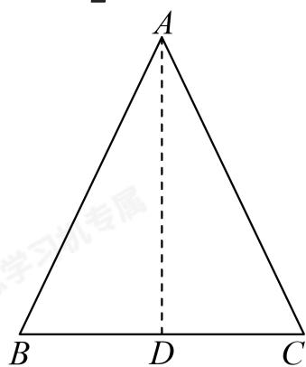

> [!faq]- 2024-2025学年内蒙古包头高一下学期期中数学试卷（景泰高级解析
>
> > [!success]- **【答案】** $1 - \frac{\varphi^2}{2}$
>
> > [!note]- **【解析】**
> > 
> >
> > 如图等腰三角形ABC中， $\angle BAC = 36^{\circ}$ ，过A作AD交BC于D，
> > 所以AD为角平分线，所以 $\sin 18^{\circ} = \frac{BD}{AB}$ ，即 $BD = AB\cdot \sin 18^{\circ}$
> >
> > 由已知可得 $\varphi = \frac{BC}{AB} = \frac{2BD}{AB} = \frac{2AB\cdot\sin18^{\circ}}{AB} = 2\sin 18^{\circ}$
> >
> > 所以 $\sin 18^{\circ} = \frac{\varphi}{2}$
> >
> > $$
> > \cos 3 6 ^ {\circ} = 1 - 2 \sin^ {2} 1 8 ^ {\circ} = 1 - 2 \times \left(\frac {\varphi}{2}\right) ^ {2} = 1 - \frac {\varphi^ {2}}{2}
> > $$
> >
> > 故答案为： $1 - \frac{\varphi^2}{2}$
