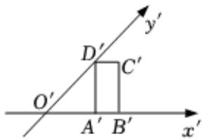

<!-- question-source:start -->
5、如图，一个水平放置的平面图形的直观图 $A'B'C'D'$ 为矩形，其中 $A'D' = 2A'B' = 2$ ，则原平面图形的周长为（）

A $3\sqrt{2}$ B 8   
C 14   
D $2 + 2\sqrt{6}$
<!-- question-source:end -->

![[Q00092326A1]]
