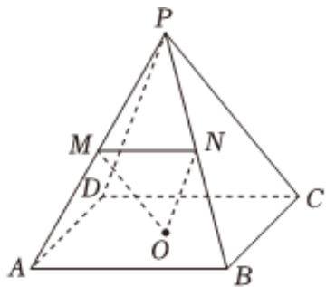

<!-- question-source:start -->
3、如图，在棱长均为1的四棱锥P-ABCD中，O为底面正方形的中心，M，N分别为侧棱PA，PB的中点，则（）

A 平面 $PCD \parallel$ 平面OMN

B $V_{P - ABCD} = \frac{\sqrt{2}}{6}$ C $PD$ 与 $OC$ 所成角大小为 $60^{\circ}$ D $ON\bot PB$
<!-- question-source:end -->

![[Q00092332A1]]
