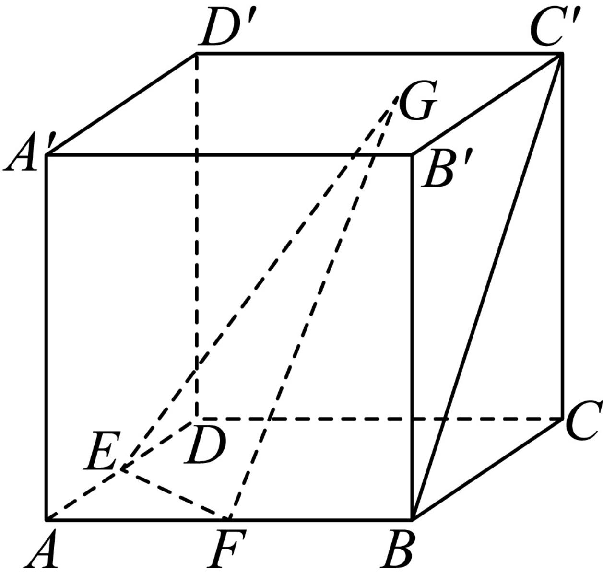

<!-- question-source:start -->
3、如图，棱长为1的正方体

ABCD 中，E，F分别为AD，AB的中点，点G在上底面 $A^{\prime}B^{\prime}C^{\prime}D^{\prime}$ （上运动，若满足 $BC^{\prime}$ //平面 $-A^{\prime}B^{\prime}C^{\prime}D^{\prime}$ 含边界）

EFG，则点G的轨迹长度为\_\_\_\_。
<!-- question-source:end -->

![[Q00092335A1]]
