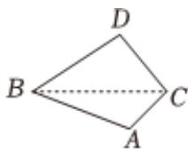
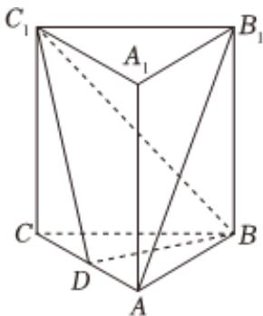

<!-- question-source:start -->
4. 如图，某海产养殖户承包一片靠岸水域，AB，AC为直线海岸线， $AB=\frac{100\sqrt{6}}{3}m$ ， $\angle BAC=\frac{2\pi}{3}$ ， $\angle CBA=\frac{\pi}{12}$

1 求 $B$ 与 $C$ 之间的直线距离；

2

在海面上有一点 $D(A,B,C,D$ 在同一平面上），沿线段DB和DC修建养殖网箱，若DB和DC上的网箱每米可获得30元的经济收益，且 $\angle BDC=\frac{\pi}{3}$ ，求这两段网箱获得的最高经济总收益.

如图，在正三棱柱ABC- $A_{1}B_{1}C_{1}$ 中，已知AB=2， $BB_{1}=3$ ，D是棱AC的中点。

1 求证： $AB_{1}$ || 平面 $C_{1}DB$ ；

2 求 $AB_{1}$ 与BD所成角的余弦值；

3 该正三棱柱被平面 $C_{1}DB$ 截去一个棱锥 $C_{1}-BCD$ ，求剩余部分的体积。
<!-- question-source:end -->

![[Q00092338A1]]
