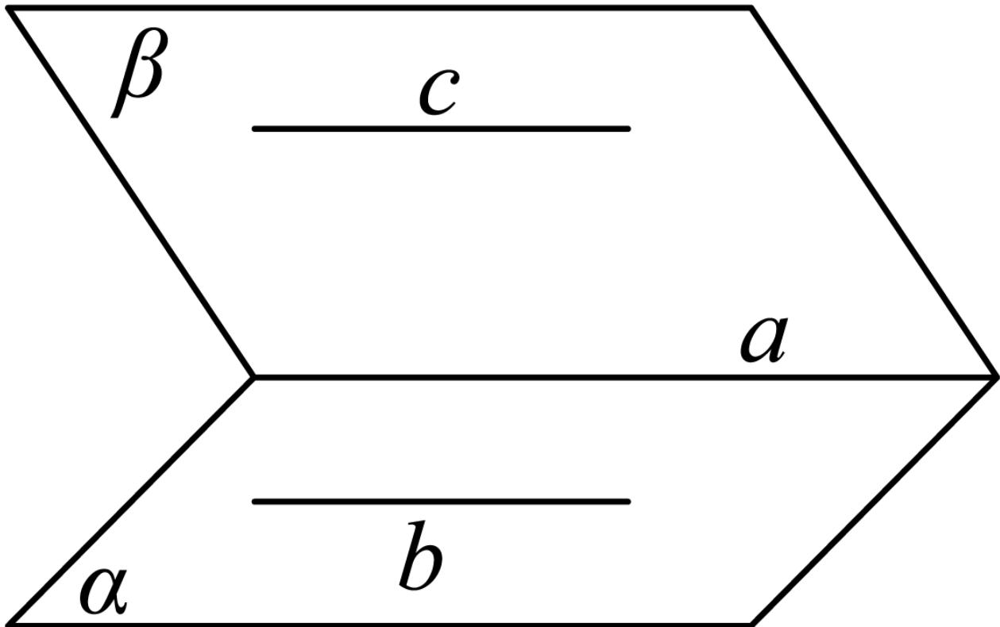

> [!faq]- 2024-2025学年内蒙古呼伦贝尔市牙克石林业一中高一（下）第二次模拟数学试卷解析
>
> > [!success]- **【答案】** D
>
> > [!note]- **【解析】**
> > 如果直线 $a$ 和平面 $\alpha$ 满足 $a / / \alpha$ ，那么 $a$ 与 $\alpha$ 内的任何直线平行或异面，所以 $A$ 选项错误；如果直线 $a$ ， $b$ 和平面 $\alpha$ 满足 $a / / \alpha, b / / \alpha,$ 那么 $a / / b$ 或 $a$ 与 $b$ 异面或相交，所以 $B$ 选项错误；如果直线 $a$ ， $b$ 和平面 $\alpha$ 满足 $a / / b, a / / \alpha,$ 那么 $b / / \alpha$ 或 $b \subset \alpha$ ，所以 $C$ 选项错误；对于 $D$ ，如图：
> >
> > 
> >
> > 因为 $b \parallel c, c \subset \beta, b \not\subset \beta,$
> >
> > 所以 $b \parallel \beta$ ，又 $b \subset \alpha, \alpha \cap \beta = a$
> >
> > 所以 $a \parallel b$ , 又 $b \parallel c$ ,
> >
> > 所以 $a \parallel b \parallel c$ ，所以D选项正确.
> >
> > 故选：D.
