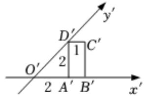
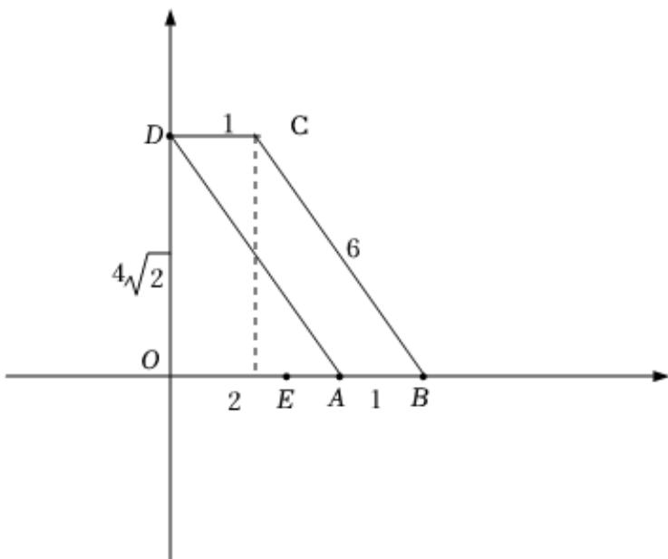

> [!faq]- 2024-2025学年内蒙古呼伦贝尔市牙克石林业一中高一（下）第二次模拟数学试卷解析
>
> > [!success]- **【答案】** C
>
> > [!note]- **【解析】**
> > 把直观图还原出原平面图形，如图所示；
> >
> > 
> >
> > 
> >
> > ∴这个原平面图形为邻边分别为6，l的平行四边形，
> >
> > 它的周长为 $6+6+1+1=14$ .
> >
> > 故选：C.
