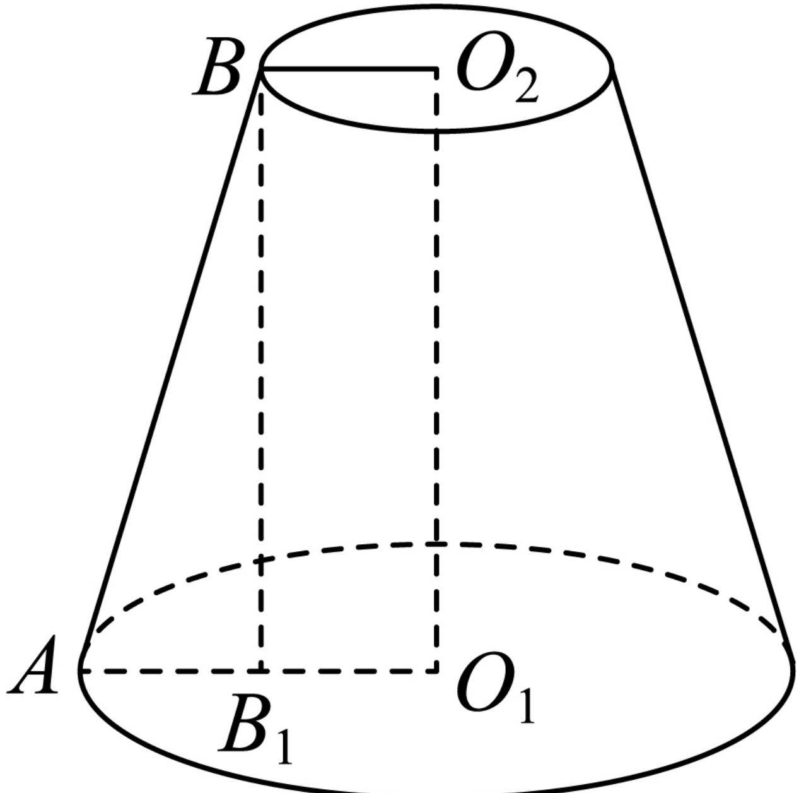

> [!faq]- 2024-2025学年内蒙古呼伦贝尔市牙克石林业一中高一（下）第二次模拟数学试卷解析
>
> > [!success]- **【答案】** B
>
> > [!note]- **【解析】**
> > 将一个半径为 $2 \mathrm{~cm}$ 的实心铁球熔化后，浇铸成一个圆台状的实心铁锭（不考虑损耗），若该圆台的一个底面周长是另一个底面周长的2倍，高为 $2 \mathrm{~cm}$ ，
> >
> > 可得圆台体积 $V=\frac{4}{3}\pi R^{3}=\frac{32\pi}{3}cm^{3}$ ，
> >
> > 如图所示，设圆台较大的底面半径为 $O_{1}A = 2r$ ，则较小的底面半径为 $O_{2}B = r$
> >
> > 
> >
> > 于是 $V = \frac{1}{3} (\pi r^2 + 4\pi r^2 + 2\pi r^2) \bullet 2 = \frac{32\pi}{3}$ ，解得 $r = \frac{4}{\sqrt{7}} cm$ ，
> >
> > 过点 $B$ 作 $BB_{1}\bot O_{1}A$ ，垂足为 $B_{1}$ ，由圆台的结构特征得 $BB_{1}\bot \mathrm{底面}O_{1}$
> >
> > 母线 $l = \sqrt{AB_1^2 + BB_1^2} = \sqrt{\left(\frac{4}{\sqrt{7}}\right)^2 + 2^2} = \frac{2\sqrt{11}}{\sqrt{7}}$
> >
> > 圆台表面积 $S = \pi \left[\left(\frac{4}{\sqrt{7}}\right)^2 +\left(\frac{8}{\sqrt{7}}\right)^2 +\left(\frac{4}{\sqrt{7}} +\frac{8}{\sqrt{7}}\right)\bullet \frac{2\sqrt{11}}{\sqrt{7}}\right] = \frac{(80 + 24\sqrt{11})\pi}{7} (cm^2).$
