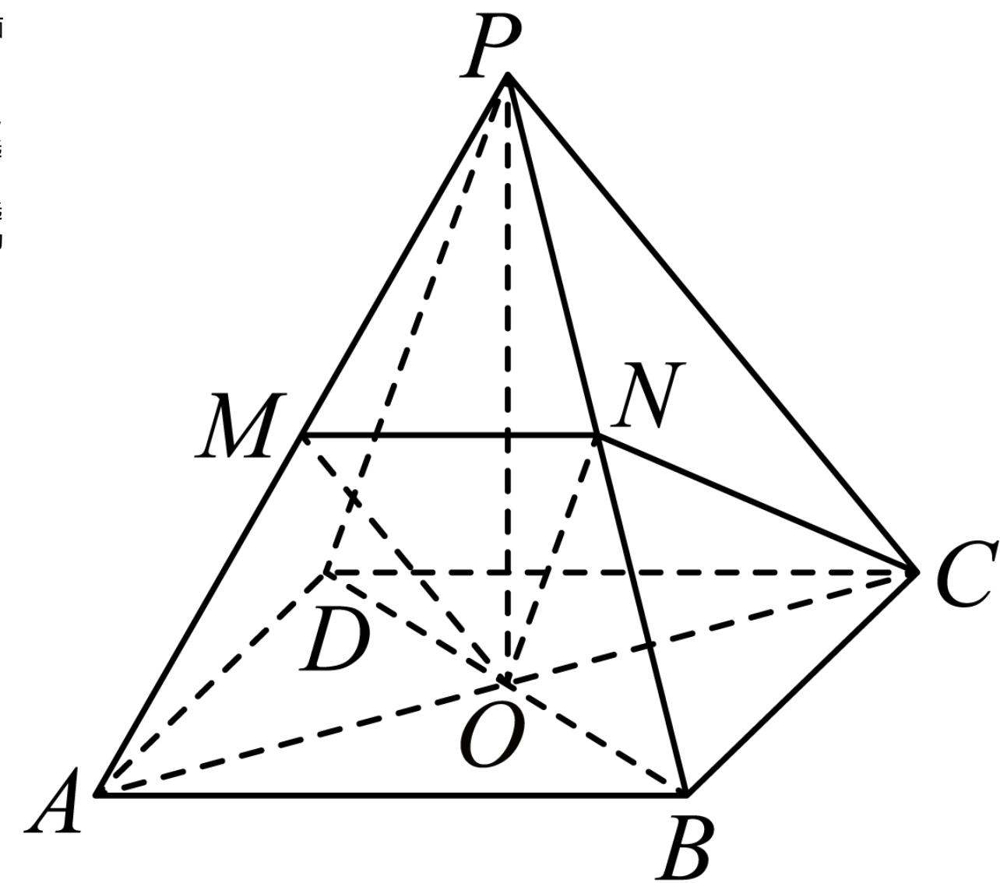

> [!faq]- 2024-2025学年内蒙古呼伦贝尔市牙克石林业一中高一（下）第二次模拟数学试卷解析
>
> > [!success]- **【答案】** ABD
>
> > [!note]- **【解析】**
> > 对于A选项，连接BD，AC，PO，根据题意易知 $ON \parallel PD$ ，ON⊂平面OMN，PD≠平面OMN，所以 $PD \parallel$ 平面OMN，同理 $CD \parallel$ 平面OMN，CD，CD，PD⊂平面CDP， $\cap PD$ = D
> >
> > 所以平面PCD//平面OMN，所以A选项正确；对于B选项，因为
> >
> > 
> >
> > $$
> > O P = \frac {1}{2} B D = \frac {\sqrt {2}}{2}
> > $$
> >
> > 所以 $V_{P - ABCD} = \frac{1}{3} |OP| \times S_{ABCD} = \frac{1}{3} \times \frac{\sqrt{2}}{2} \times 1 = \frac{\sqrt{2}}{6}$ ，所以 $B$ 选项正确.
> >
> > 对于 $C$ ，由于 $O$ ， $N$ 分别为侧棱 $BD$ ， $PB$ 的中点，所以 $ON \parallel PD$
> >
> > 所以 $PD$ 与 $OC$ 所成角为 $\angle NOC$ （或其补角），
> >
> > 又 $ON = \frac{1}{2}$ ， $OC = \frac{\sqrt{2}}{2}$ ， $NC = \frac{\sqrt{3}}{2}$ ，所以 $ON^2 + OC^2 = NC^2$
> >
> > 所以 $\angle NOC = 90^{\circ}$ ，所以 $C$ 选项错误；
> >
> > 对于D选项，因为PB=PD=1， $BD=\sqrt{2}$ ，
> >
> > 所以 $PD^{2} + PB^{2} = BD^{2}$ ，所以 $PD \perp PB$ ，又 $ON \parallel PD$
> >
> > 所以 $ON \perp PB$ ，所以D选项正确.
> >
> > 故选：ABD.
