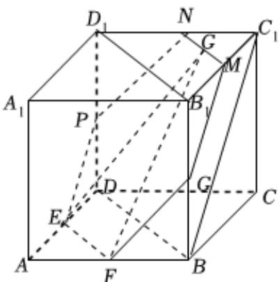

> [!faq]- 2024-2025学年内蒙古呼伦贝尔市牙克石林业一中高一（下）第二次模拟数学试卷解析
>
> > [!success]- **【答案】** $\lambda + 3\mu = 1$
>
> > [!note]- **【解析】**
> > 在 $\triangle ABC$ 中， $D$ 为 $AC$ 上的一点，满足 $\overrightarrow{AD} = \frac{1}{2}\overrightarrow{DC}$ ，所以 $\overrightarrow{AC} = 3\overrightarrow{AD}$ ，若 $P$ 为 $BD$ 上的一点，满足 $\overrightarrow{AP} = \lambda \overrightarrow{AB} + \mu \overrightarrow{AC} (\lambda > 0, \mu > 0)$ ，所以 $\overrightarrow{AP} = \lambda \overrightarrow{AB} + \mu \overrightarrow{AC} = \lambda \overrightarrow{AB} + 3\mu \overrightarrow{AD}$ ，因为 $B, P, D$ 三点共线，所以 $\lambda + 3\mu = 1$ 。故答案为： $\lambda + 3\mu = 1$ 。
> >
> > 
