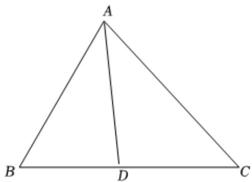

> [!faq]- 2024-2025学年内蒙古呼伦贝尔市牙克石林业一中高一（下）第二次模拟数学试卷解析
>
> > [!success]- **【答案】** 详见解析
>
> > [!note]- **【解析】**
> > 详见解析
> >
> > (1) 因为 $2\sin(B-\frac{\pi}{6})=\frac{\cos C}{\cos A}$
> >
> > 整理可得 $\cos C = 2\sin (B - \frac{\pi}{6})\cos A = (\sqrt{3}\sin B - \cos B)\cos A$
> >
> > 在 $\triangle ABC$ 中， $\cos C = -\cos (A + B) = \sin A\sin B - \cos A\cos B$
> >
> > 整理可得： $\sqrt{3}\sin B\cos A = \sin A\sin B$
> >
> > 因为 $\sin B > 0$ ，所以 $\sin A = \sqrt{3}\cos A$
> >
> > 即 $tanA=\sqrt{3}$ ，
> >
> > 因为 $0 < A < \pi$ ，所以 $A = \frac{\pi}{3}$
> >
> > (2)因为b=4， $\triangle ABC$ 面积为 $5\sqrt{3}$ ，
> >
> > $$
> > S _ {\triangle A B C} = \frac {1}{2} b c \sin A = \frac {1}{2} \times 4 \times c \times \frac {\sqrt {3}}{2} = 5 \sqrt {3}
> > $$
> >
> > 解得c=5，内角A的角平分线为AD，
> >
> > 根据 $S_{\triangle ABD} + S_{\triangle ACD} = S_{\triangle ABC}$ ，即
> >
> > $$
> > \frac {1}{2} c \bullet A D \sin \frac {\pi}{6} + \frac {1}{2} b \bullet A D \sin \frac {\pi}{6} = 5 \sqrt {3},
> > $$
> >
> > $$
> > \frac {1}{2} \times 5 \bullet A D \times \frac {1}{2} + \frac {1}{2} \times 4 \bullet A D \times \frac {1}{2} = 5 \sqrt {3},
> > $$
> >
> > 解得AD= $\frac{20\sqrt{3}}{9}$ .
> >
> > 
