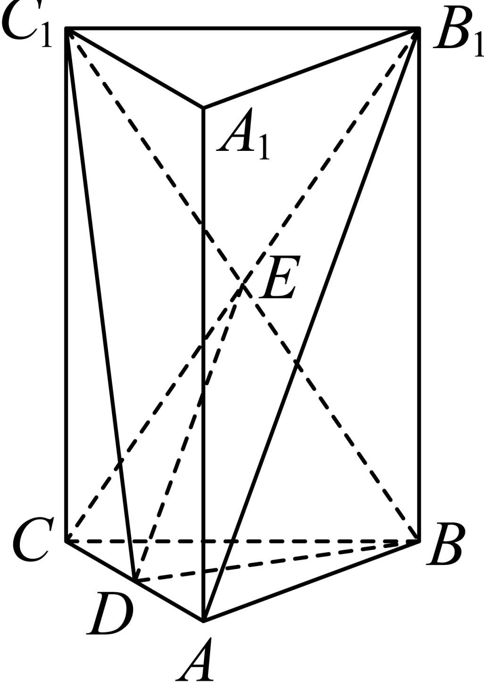
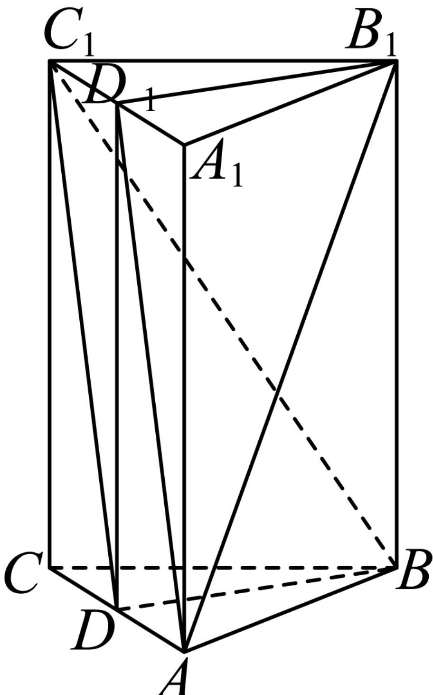

> [!faq]- 2024-2025学年内蒙古呼伦贝尔市牙克石林业一中高一（下）第二次模拟数学试卷解析
>
> > [!success]- **【答案】** 详见解析
>
> > [!note]- **【解析】**
> > 详见解析
> >
> > （1）如图，连接 $B_{1}C$ ，交 $BC_{1}$ 于点E，则E为 $B_{1}C$ 中点，
> >
> > 
> >
> > 又 $D$ 为 $AC$ 中点，所以 $DE \parallel AB_{1}$
> >
> > 又 $DE \subset$ 面 $BDC_{1}$ ，且 $AB_{1} \notin$ 面 $BDC_{1}$
> >
> > 所以 $AB_{1}$ // 平面 $BDC_{1}$ ;
> >
> > (2)设 $A_{1}C_{1}$ 中点为 $D_{1}$ ，连接 $DD_{1}$ ， $AD_{1}$
> >
> > 因为 $D$ 是棱 $AC$ 的中点，所以 $DD_{1} \parallel BB_{1}$ 且 $DD_{1} = BB_{1}$
> >
> > 所以四边形 $DD_{1}B_{1}B$ 为平行四边形，所以 $BD\parallel B_{1}D_{1}$
> >
> > 又 $AB = 2$ ， $B_{1}B = 3$ ， $B_{1}D_{1} = \sqrt{3}$ ， $AB_{1} = \sqrt{13}$ ， $AD_{1} = \sqrt{10}$
> >
> > 所以 $cos\angle AB_{1}D_{1}=\frac{3+13-10}{2\sqrt{3}\times\sqrt{13}}=\frac{\sqrt{39}}{13}$ ，
> >
> > 所以 $AB_{1}$ 与BD所成角的余弦值 $\frac{\sqrt{39}}{13}$ ;
> >
> >   
> > (3)在正三棱柱 $ABC - \overline{A}_{1}\overline{B}_{1}C_{1}$ 中，底面ABC为等边三角形，
> >
> > $$
> > A B = 2, S _ {\triangle A B C} = \frac {1}{2} \times 2 \times 2 \times \frac {\sqrt {3}}{2} = \sqrt {3},
> > $$
> >
> > $$
> > V _ {A B C - A _ {1} B _ {1} C _ {1}} = S _ {\triangle A B C} \bullet | A A _ {1} | = 3 \sqrt {3},
> > $$
> >
> > $$
> > V _ {C _ {1} - B D C} = \frac {1}{3} \times \frac {1}{2} S _ {\triangle A B C} | C C _ {1} | = \frac {1}{6} \times \sqrt {3} \times 3 = \frac {\sqrt {3}}{2},
> > $$
> >
> > 所以剩余部分的体积 $V = V_{ABC - A_1B_1C_1} - V_{C_1 - BDC} = \frac{5\sqrt{3}}{2}$
