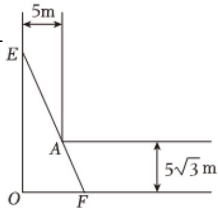

<!-- question-source:start -->
3、

现有足够长的“L”型的河道，如图所示，宽度分别为5m和 $5\sqrt{3}m$ ，若经过点A拉张网EF，开辟如图的直角 $\triangle EOF$ 用于养鱼，设 $\angle OEF=0$ 。

1 求渔网长度EF，用含有θ的式子表示，并写出定义域；

2 求养殖面积 $S_{\triangle EOF}$ 的最小值，及此时的 $\theta$ 值。
<!-- question-source:end -->

![[Q00090865A1]]
