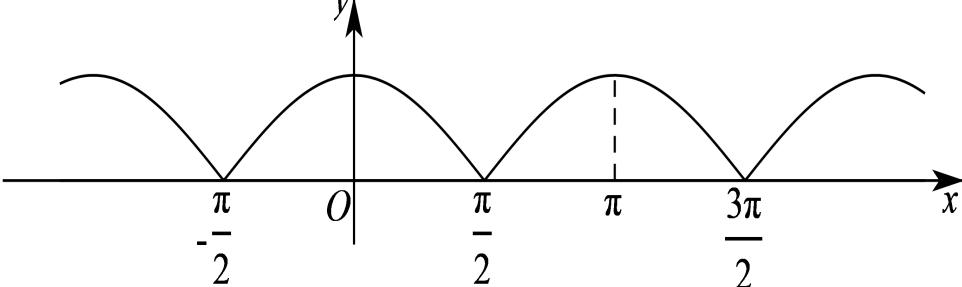
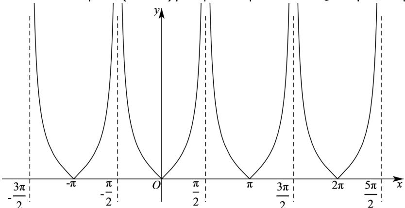

> [!faq]- 2024-2025学年内蒙古呼和浩特一中高一（下）期中数学试卷解析
>
> > [!success]- **【答案】** D
>
> > [!note]- **【解析】**
> > 对于 $A$ ，因为 $\left|\cos (x + \pi)\right| = \left| - \cos x\right| = \left|\cos x\right|$ ，作出函数 $y = |\cos x|$ 的图象如下图所示：
> >
> > 
> >
> > 由图可知，函数 $y = |\cos x|$ 的最小正周期为 $\pi$ ，当 $\frac{\pi}{2} < x < \pi$ 时， $y = |\cos x| = -\cos x$ ，则函数 $y = |\cos x|$ 在 $(\frac{\pi}{2}, \pi)$ 上单调递增，故 $A$ 不符合题意；对于 $B$ ，函数 $y = \sin x \cos x = \frac{1}{2} \sin 2x$ 的最小正周期为 $T = \frac{2\pi}{2} = \pi$ ，且当 $\frac{\pi}{2} < x < \pi$ 时， $\pi < 2x < 2\pi$ ，所以函数 $y = \frac{1}{2} \sin 2x$ 在 $(\frac{\pi}{2}, \pi)$ 上不单调，故 $B$ 不符合题意；对于 $C$ ，函数 $y = \sin 2x - \cos 2x = \sqrt{2} \sin (2x - \frac{\pi}{4})$ 的最小正周期为 $T = \frac{2\pi}{2} = \pi$ ，当 $\frac{\pi}{2} < x < \pi$ 时， $\frac{3\pi}{4} < 2x - \frac{\pi}{4} < \frac{7\pi}{4}$ ，则函数 $y = \sqrt{2} \sin (2x - \frac{\pi}{4})$ 在 $(\frac{\pi}{2}, \pi)$ 上不单调，故 $C$ 不符合题意；对于 $D$ ，因为 $|\tan (x + \pi)| = |\tan x|$ ，作出函数 $y = |\tan x|$ 的图象如下图所示：
> >
> > 
> >
> > 由图可知，函数 $y = |\tan x|$ 的最小正周期为 $\pi$ ，
> >
> > 且当 $\frac{\pi}{2} < x < \pi$ 时， $y = |\tan x| = -\tan x$ ，故函数 $y = |\tan x|$ 在 $y = |\tan x|$ 上单调递减，故 $D$ 符合题意.
> >
> > 故选：D.
