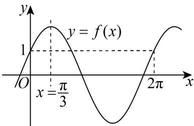

> [!faq]- 2024-2025学年内蒙古呼和浩特一中高一（下）期中数学试卷解析
>
> > [!success]- **【答案】** BCD
>
> > [!note]- **【解析】**
> > $$
> > f (x) = \sqrt {3} \sin x + \cos x = 2 \sin \left(x + \frac {\pi}{6}\right),
> > $$
> >
> > 当 $x \in [\frac{\pi}{6}, \frac{2\pi}{3}]$ 时， $\frac{\pi}{3} \leq x + \frac{\pi}{6} \leq \frac{5\pi}{6}$ ，此时函数 $f(x)$ 有增有减，故 $A$ 错误；
> >
> > 因为 $f(-\frac{\pi}{6}) = 2sin(-\frac{\pi}{6} + \frac{\pi}{6}) = 0$ ，所以 $(- \frac{\pi}{3}, 0)$ 是 $f(x)$ 的一个对称中心，故 $B$ 正确；
> >
> > $f(x)$ 的图象向左平移 $m$ 个单位长度后得到 $g(x) = f(x + m) = 2\sin (x + \frac{\pi}{6} +m)$ 是偶函数，
> >
> > 所以 $\frac{\pi}{6} + m = k\pi + \frac{\pi}{2}$ , $k \in Z$ ,
> >
> > 当 $k = 0$ 时， $m_{min} = \frac{\pi}{3}$ ，故 $C$ 正确；
> >
> > 因为 $x\in[0,2\pi]$ ，作出 $f(x)$ 在 $x\in[0,2\pi]$ 上的图象如图所示，
> >
> > 
> >
> > $f(x)$ 与 $y = m$ 有且只有三个交点，所以 $x_{3} = 2\pi$
> >
> > 又因为 $f(x) = 2$ 时 $x = \frac{\pi}{3}$ ，且 $x_{1}, x_{2}$ 关于直线 $x = \frac{\pi}{3}$ 对称，
> >
> > 所以 $x_{1} + x_{2} = 2 \times \frac{\pi}{3} = \frac{2\pi}{3}$ ，所以 $x_{1} + x_{2} + x_{3} = \frac{2\pi}{3} + 2\pi = \frac{8\pi}{3}$
> >
> > $\tan(x_{1}+x_{2}+x_{3})=\tan\frac{8\pi}{3}=\tan\frac{2\pi}{3}=-\sqrt{3}$ ，故D正确.
> >
> > 故选：BCD.
