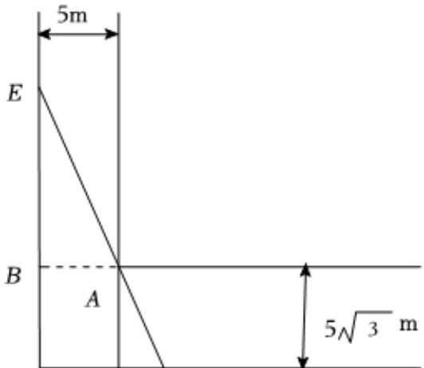

> [!faq]- 2024-2025学年内蒙古呼和浩特一中高一（下）期中数学试卷解析
>
> > [!success]- **【答案】** 详见解析
>
> > [!note]- **【解析】**
> > 详见解析
> >
> > （1）过点 $A$ 作 $AB$ ， $AC$ 垂直于 $OA$ ， $OB$ ，垂足为 $B$ ， $C$ 则 $AB = OC = 5$ ， $AC = OB = 5\sqrt{3}$ ， $\angle OEF = \angle CAF = \theta$ 又因为 $\frac{AB}{AE} = \sin \theta, \frac{AC}{AF} = \cos \theta$
> >
> > 所以 $AE = \frac{AB}{\sin\theta} = \frac{5}{\sin\theta}$ ， $AF = \frac{AC}{\cos\theta} = \frac{5\sqrt{3}}{\cos\theta}$
> >
> > 所以 $EF = AE + AF = \frac{5}{sin\theta} +\frac{5\sqrt{3}}{cos\theta},\theta \in (0,\frac{\pi}{2});$
> >
> > 
> >
> > O C F
> >
> > (2) $BE=\frac{AB}{\tan\theta}=\frac{5}{\tan\theta},CF=AC\tan\theta=5\sqrt{3}\tan\theta,$
> >
> > 所以 $OE = OB + BE = 5\sqrt{3} + \frac{5}{\tan\theta}$ , $OF = OC + CF = 5 + 5\sqrt{3}\tan \theta$
> >
> > 所以 $S_{\triangle EOF} = \frac{1}{2} OE\bullet OF = \frac{1}{2}\times (5\sqrt{3} +\frac{5}{tan\theta})\times (5 + 5\sqrt{3} tan\theta)$
> >
> > $$
> > = \frac {1}{2} (2 5 \sqrt {3} + 7 5 \tan \theta + \frac {2 5}{\tan \theta} + 2 5 \sqrt {3})
> > $$
> >
> > $$
> > = \frac {1}{2} \times (5 0 \sqrt {3} + 7 5 t a n \theta + \frac {2 5}{t a n \theta}) \geq \frac {1}{2} \times (5 0 \sqrt {3} + 2 \sqrt {7 5 t a n \theta \bullet \frac {2 5}{t a n \theta}})
> > $$
> >
> > $$
> > = \frac {1}{2} \times (5 0 \sqrt {3} + 5 0 \sqrt {3}) = 5 0 \sqrt {3},
> > $$
> >
> > 当且仅当 $75\tan \theta = \frac{25}{\tan\theta}$ ，即 $\tan^2\theta = \frac{1}{3}$ ， $\tan \theta = \frac{\sqrt{3}}{3}$ ， $\theta = \frac{\pi}{6}$ 时取等号，所以养殖面积 $S_{\triangle EOF}$ 的最小值为 $50\sqrt{3}$ ，此时的 $\theta = \frac{\pi}{6}$
