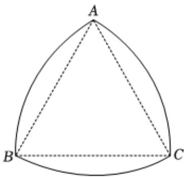

<!-- question-source:start -->
5、函数 $f(x)=tan(3x-\frac{\pi}{3})$ 的图象的一个对称中心是（）
A $(- \frac{\pi}{9}, 0)$ B $(- \frac{\pi}{18}, 0)$ C $(\frac{2\pi}{9}, 0)$ D $(\frac{\pi}{3}, 0)$

<!-- question-source:end -->

![[Q00090911A1]]
