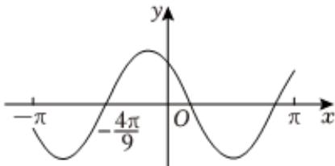

<!-- question-source:start -->
7、设函数 $f(x) = \cos (\omega x + \frac{\pi}{6})$ 在 $[- \pi, \pi]$ 的图象大致如图，则 $f(x)$ 的最小正周期为（）

A $\frac{10\pi}{9}$ B $\frac{7\pi}{6}$ C $\frac{4\pi}{3}$ D $\frac{3\pi}{2}$
<!-- question-source:end -->

![[Q00090913A1]]
